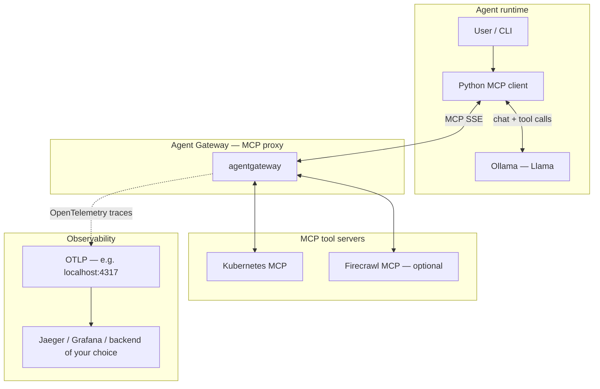

# Agentic AI observability (PoC)

A Python agent uses Ollama (Llama family models) for reasoning, calls tools through [AgentGateway](https://agentgateway.dev/), an open-source, AI-native proxy that routes agent ↔ MCP server traffic—and uses OpenTelemetry so you can trace agent-to-tool calls end to end.

AgentGateway sits in the middle so tool access is federated (e.g. Kubernetes MCP, Firecrawl MCP) and observability can attach at the gateway boundary, not inside every tool.

## What this v1 showcases

- Observable agent workflows — OTLP-based tracing (`config.yaml` points at `http://localhost:4317`) to follow requests across the proxy and tool boundary.
- Centralized MCP routing — One SSE endpoint through the gateway instead of ad hoc tool wiring.
- Local LLM — Ollama drives tool selection; the client executes `list_tools` / `call_tool` via the gateway.

## Architecture

## Stack (v1)

- Python
- MCP
- [AgentGateway](https://agentgateway.dev/)
- Ollama (Llama)
- OpenTelemetry (OTLP)
- Kubernetes MCP / Firecrawl MCP (optional)

## Quick start

1. Run Agent Gateway with something like the sample `config.yaml` (listener port, MCP targets, tracing block).
2. From `py-mcp-client/`: `uv sync` then `uv run agent.py` (gateway SSE URL defaults in `agent.py`; align with your bind port).

More detail can land in later versions; this file stays intentionally short for a first read.

## Learn more

- [agentgateway.dev](https://agentgateway.dev/) — connect, secure, and observe agent-to-tool traffic (including OpenTelemetry).
